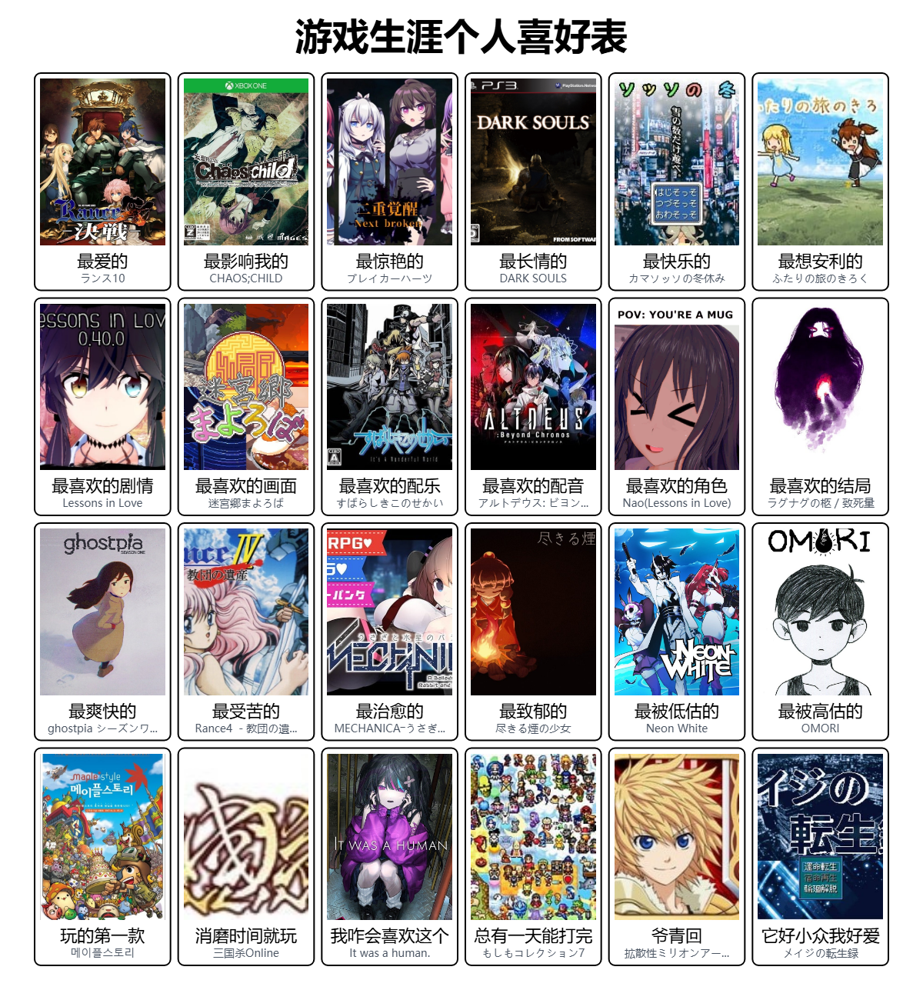

# GameGrid - 游戏生涯个人喜好表



生成你自己的游戏生涯个人喜好表！

标题，名称，全部可以自由定义！

## 欢迎Fork！

在遵守MIT License的前提下，欢迎自由的改写表格内容或自定义数据源进行分发。  
如果愿意，可以将自己创作的表格在[discussions](https://github.com/SomiaWhiteRing/gamegrid/discussions/2)中留言，我看到后会更新在项目主页！

## 快速开始

克隆仓库并安装依赖项：

```bash
git clone https://github.com/yourusername/gamegrid.git
cd gamegrid
npm install
```

运行开发服务器：

```bash
npm run dev
```

访问 [http://localhost:3000](http://localhost:3000) 查看应用。

## 环境变量

创建`.env.local`文件，添加以下配置：

```bash
# SteamGridDB API配置
STEAMGRIDDB_API_KEY=your_steamgriddb_api_key

# Bangumi API配置
BANGUMI_ACCESS_TOKEN=your_bangumi_access_token
BANGUMI_USER_AGENT=your_user_agent

# Google Analytics配置（可选）
NEXT_PUBLIC_GA_ID=your_google_analytics_id
```

### API密钥获取方式

- **SteamGridDB API Key**:
  1. 访问 [SteamGridDB](https://www.steamgriddb.com/)
  2. 注册并登录账号
  3. 在个人设置中申请 API 密钥

- **Bangumi Access Token**:
  1. 访问 [Bangumi API](https://bangumi.github.io/api/#/%E6%9D%A1%E7%9B%AE/getCalendar)
  2. 登录并创建应用
  3. 获取 Access Token
  4. 设置合适的 User Agent（参考[bangumiUA指南](https://github.com/bangumi/api/blob/master/docs-raw/user%20agent.md)）

- **Google Analytics ID**（可选）:
  1. 访问 [Google Analytics](https://analytics.google.com/)
  2. 创建账号并设置数据流
  3. 获取衡量 ID（格式：`G-XXXXXXXXXX`）
  4. 仅在生产环境启用，不配置则不启用追踪

## 部署

### Vercel 部署（推荐）

1. Fork 本仓库到你的 GitHub 账号
2. 在 [Vercel](https://vercel.com) 导入项目
3. 在项目设置中添加环境变量：
   - `STEAMGRIDDB_API_KEY`
   - `BANGUMI_ACCESS_TOKEN`
   - `BANGUMI_USER_AGENT`
   - `NEXT_PUBLIC_GA_ID`（可选，用于 Google Analytics 追踪）
4. 部署完成

### 其他平台部署

确保在部署平台的环境变量配置中添加上述所有必需的环境变量。Google Analytics ID 为可选配置，不配置则不会启用追踪功能。

## 开发历程

本项目使用GitHub Copilot与Codex辅助开发，提高了开发效率和代码质量。

## 致谢

- 特别感谢[游戏生涯个人喜好表（已下线）](https://gamegrid.azurewebsites.net)项目的灵感，本项目是对该创意的致敬。
- 感谢 [SteamGridDB](https://www.steamgriddb.com/) 和 [Bangumi](https://bgm.tv/) 提供的API支持。

## 许可证

MIT许可证 - 详情请参阅[LICENSE](LICENSE)文件
